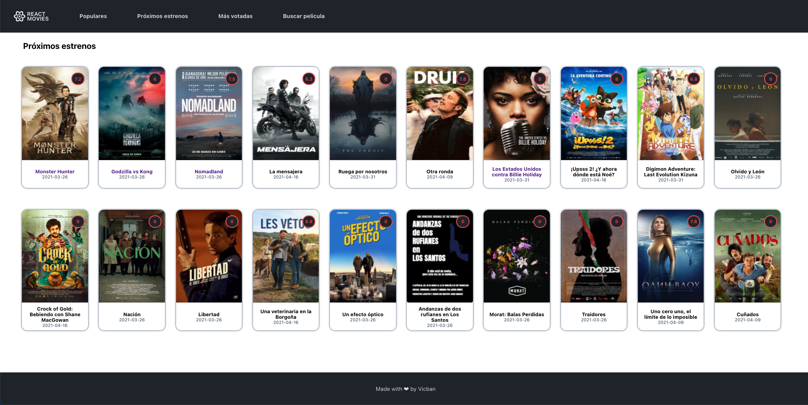
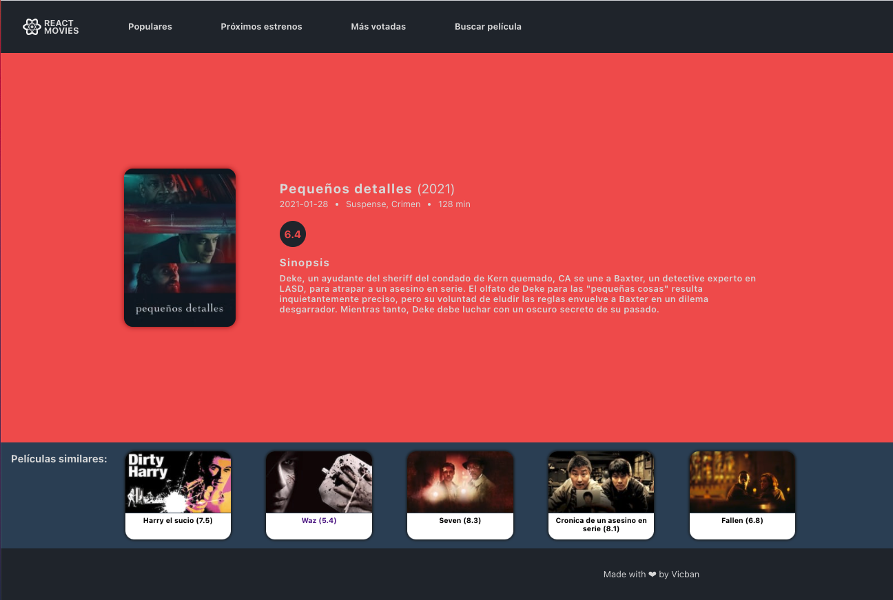
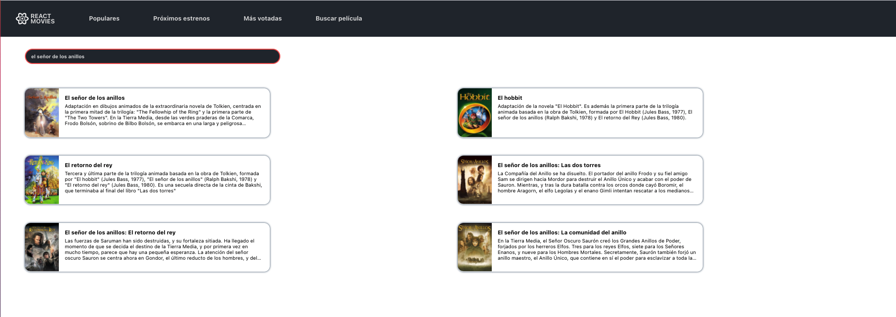

# REACT MOVIES

## What is React Movies?

The purpose of this project is be an informative site of movies. It has been created with React, React Hooks, Javascript and Sass.

## Description

### Movies list pages



### Movies Detail Pages



### Search Movie Page



## Usage

1. Use your mouse to navigate through the website.
2. Click one movie to get additional info.
3. Use the search bar to search any movie and press enter to go the detail page or if there are more than one march go to the search page.

## How to launch the application

In the project directory, you can run:

```
yarn start
```

## Future Improvements

1. Adapt the web to be responsive.
2. Deep reading of Sass documentation and use good practices in .scss files.
3. Add CRUD and connect with database.
4. Save favourite films in user database.
5. Expand the website to TV Shows, actors and actresses.
